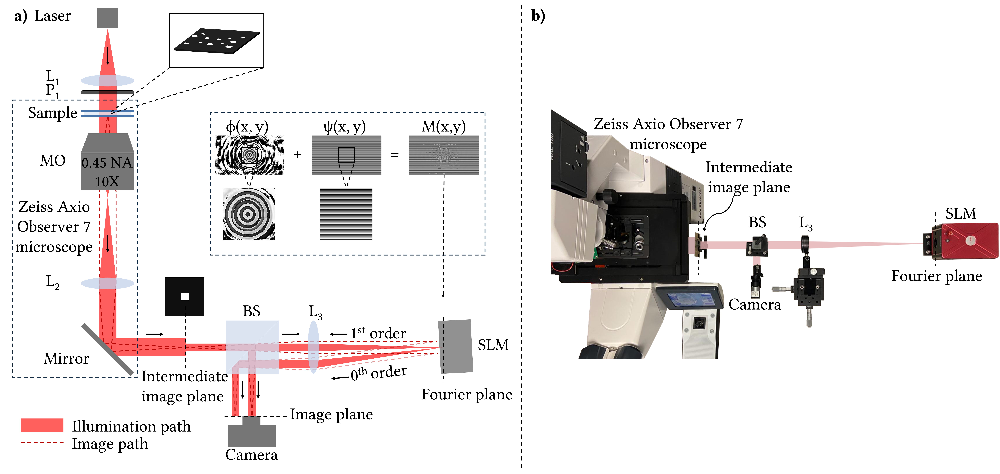
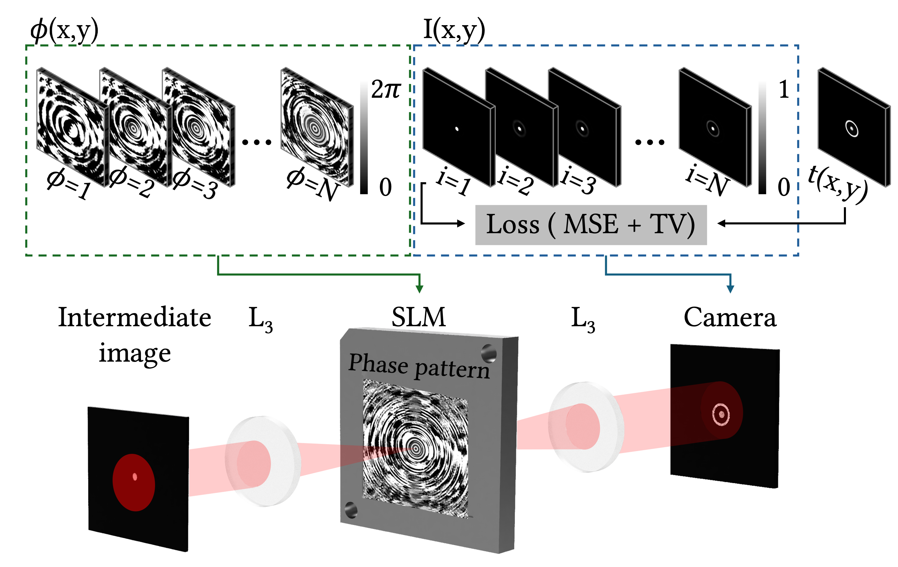
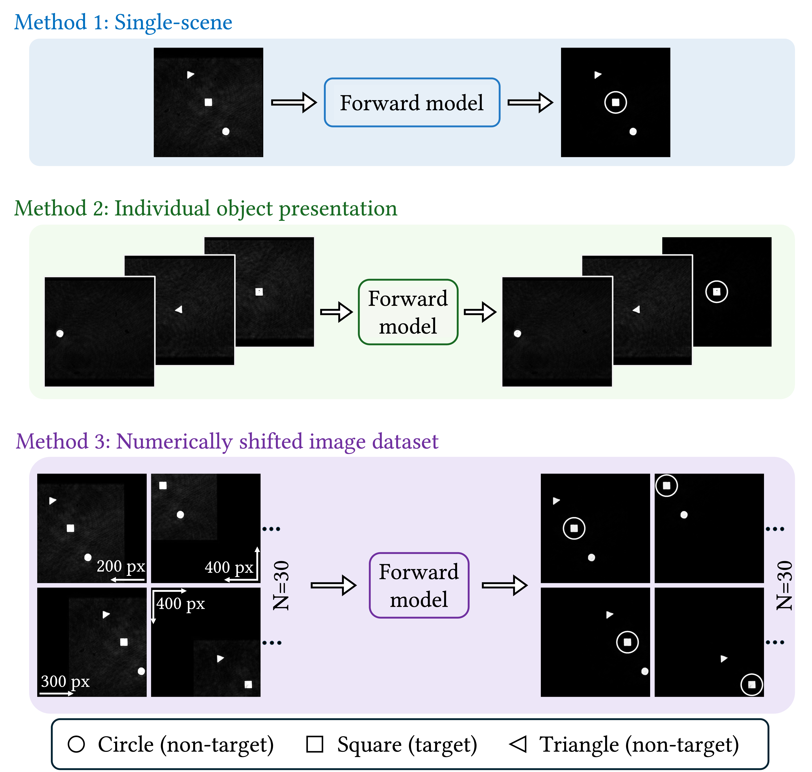
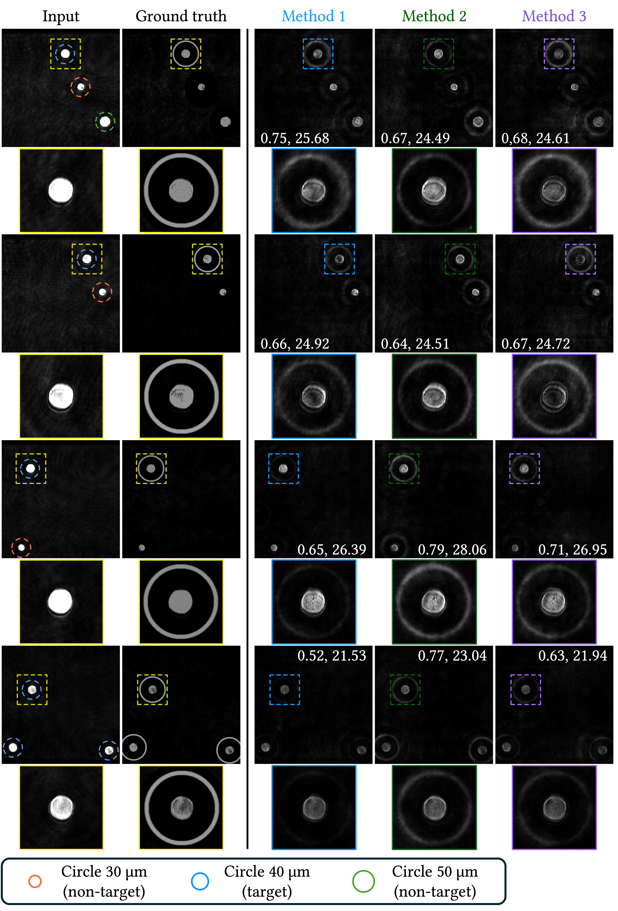
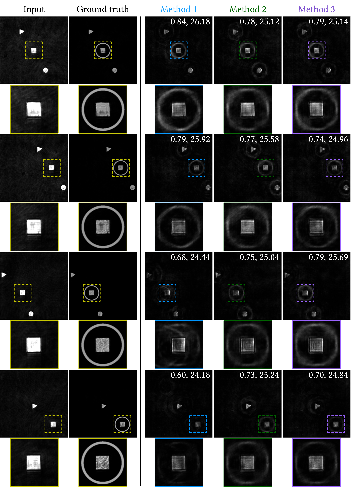

<!-- LEFT CONTENTS -->

<strong>Contents</strong>

<a href="#video">Video</a>

<a href="#abstract">Abstract</a>

<!-- METHODS -->

<a href="#methods">Methods</a>

<a href="#optical-setup">Optical Setup</a>

<a href="#forward-model">Forward Model</a>

<a href="#optimization">Optimization Methods</a>

<a href="#method1">Method 1: Single-scene optimization</a>

<a href="#method2">Method 2: Individual object presentation</a>

<a href="#method3">Method 3: Numerically shifted dataset</a>

<!-- RESULTS -->

<a href="#results">Results</a>

<a href="#scenario1">Scenario 1: Object highlighting</a>

<a href="#scenario2">Scenario 2: Size-based highlighting</a>

<a href="#scenario3">Scenario 3: Morphology-based highlighting</a>

<a href="#acknowledgment">Acknowledgment</a>

<!-- RIGHT MAIN CONTENT-->

<!-- PROJECT TITLE-->
<h1>
All-Optical Selective Target Highlighting for Augmented Reality Microscopy
</h1>

<!--  AUTHORS -->

<strong>
Maha Sahloul1,2, Kaan Akşit3, and M. Fatih Toy1,2
</strong>

1 Istanbul Medipol University
 
2 Biophotonics and Computational Imaging Laboratory (Phi-X), Research Institute for Health Sciences and Technologies (SABITA)
 
3 University College London

<!-- RESOURCES -->
<h2 id="resources">Resources</h2>

📄 <a href="https://opg.optica.org/optcon/fulltext.cfm?uri=optcon-5-8-2708" target="_blank" rel="noopener">Manuscript</a>
&nbsp;&nbsp;&nbsp;
📑 <a href="https://opticapublishing.figshare.com/articles/journal_contribution/Supplementary_document_for_All-Optical_Selective_Target_Highlighting_for_Augmented_Reality_Microscopy_-_7967150_pdf/32886380?file=67315379" target="_blank" rel="noopener">Supplementary Material</a>
&nbsp;&nbsp;&nbsp;
🖼️ <a href="YOUR_POSTER_LINK" target="_blank" rel="noopener">Poster</a>

<!--  VIDEO -->

<h2 id="video">Video</h2>

<iframe src="https://widgets.figshare.com/articles/32841446/embed?show_title=0" width="777" height="480" allowfullscreen frameborder="0"></iframe>

<!-- ABSTRACT -->

<h2 id="abstract">Abstract</h2>

Augmented Reality (AR) microscopy can enhance microscopic observation by highlighting specific targets, but computational processing can limit its real-time use. We introduce an all-optical solution based on precomputed SLM phase masks that selectively highlight objects according to their shape or size. The approach maintains highlighting as objects move within the field of view, without requiring continuous image processing or tracking.

<!--  METHODS -->

<h2 id="methods">Methods</h2>

<!-- OPTICAL SETUP -->

<h3 id="optical-setup">Optical Setup</h3>

We use a 655 nm laser, collimated by L1, to illuminate the sample mounted on a Zeiss Axio Observer 7 microscope. The beam passes through a linear polarizer aligned with the SLM phase-modulation axis and illuminates the sample through a 10×/0.45 NA objective. The transmitted image is relayed through a 4f optical system to an intermediate image plane, followed by a beam splitter and a 300 mm focal-length lens that positions the SLM at the Fourier plane. We suppress the undesired zeroth-order reflection and select the first diffraction order by adding a blazed grating phase to the SLM phase pattern and applying a 1.16° physical SLM tilt. This configuration shifts the desired first diffraction order onto the camera ROI while displacing the zeroth order outside the detection region.

<strong>Figure 1.</strong>
a) Schematic presents our optical setup including L1: Collimation lens, P1: Polarizer, MO: Microscope objective, L2: Tube lens, BS: Beam splitter, L3: Fourier lens, SLM: Spatial light modulator, ϕ(x, y): Adaptive phase, ψ(x, y): Blazed grating phase, M(x, y): SLM phase. b) Photograph of the experimental setup.

<!-- FORWARD MODEL -->

<h3 id="forward-model">Forward Model</h3>

The optical system is numerically modeled as a 4f system, where the input field
\(U_{in}(x,y)\) propagates from the intermediate image plane to the SLM plane
using the Angular Spectrum Method (ASM):

\[
U_{p1}(x,y;z)=\mathcal{F}^{-1}
\left\{
\mathcal{F}\left(U_{in}(x,y,0)\right)
H(f_x,f_y;z)
\right\}
\]

\[
H(f_x,f_y;z)=
\exp\left[
ikz\sqrt{1-(\lambda f_x)^2-(\lambda f_y)^2}
\right].
\]

The propagated field is modulated by the lens and then reaches the SLM, where
the optimized phase mask is applied:

\[
M(x,y)=\exp\left[i\left(\phi(x,y)+\psi(x,y)\right)\right].
\]

where \(\phi(x,y)\) is the adaptive phase and \(\psi(x,y)\) is the blazed grating phase.
The resulting field is propagated to the camera plane to obtain the output intensity
\(I(x,y)\). The phase mask is optimized by minimizing a combined Mean Squared Error (MSE)
and Total Variation (TV) loss:

\[
\mathcal{L}=\mathcal{L}_{MSE}+\mathcal{L}_{TV}.
\]

<!--OPTIMIZATION METHOD -->

<h3 id="optimization">Optimization Methods</h3>

We evaluate three optimization strategies that progressively increase the diversity of input data, from a single scene to individual objects and numerically shifted image datasets. All methods use the same forward model to optimize the phase mask, allowing us to examine the effects of input diversity on target highlighting, robustness to new scenes, and computational cost.

<strong style="color: #2F6DB2;">Method 1: Single-scene optimization.</strong>
The phase mask is optimized using a single scene containing multiple objects, with the target distribution highlighting only the desired object.

<strong style="color: #3A8F5C;">Method 2: Individual object presentation.</strong>
We present the objects individually during optimization, allowing the phase mask to encode target-specific patterns. This approach reduces dependence on the optimized scene and allows the target to be highlighted more independently of surrounding objects.

<strong style="color: #7A4FA3;">Method 3: Numerically shifted image dataset.</strong>
The input scene is numerically shifted to generate diverse spatial configurations without requiring additional image acquisition. The target is shifted accordingly to maintain the desired augmentation across different object positions.

<h2 id="results">Results</h2>

<h3 id="scenario1">Scenario 1: Object highlighting</h3>

In the offline stage (I), the phase mask is optimized using a 30 µm diameter circle as the target, generating the precomputed SLM phase pattern (SLM-P). In the real-time augmentation stage (II), the precomputed SLM-P is applied to novel scenes to selectively highlight the target objects. Across 45 novel scenes, the experimental and simulated outputs achieved a mean CC of <strong>0.75 ± 0.03</strong> and PSNR of <strong>27.60 ± 0.61 dB</strong>.

 <h3 id="scenario2">Scenario 2: Size-based selective object highlighting</h3>

We optimize phase mask to highlight 40 µm-diameter circular objects.
<strong>Method 1</strong>
performs effectively on the optimization scene and scenes with high similarity to it, but its performance decreases as the input scene differs from the optimized scene.
<strong>Method 2</strong>
and
<strong>Method 3</strong>
provide more consistent target highlighting across novel scenes.
<strong>Method 2</strong>
achieve the highest CC of 0.68 and PSNR of 24.07 dB, followed by
<strong>Method 3</strong>
with a CC of 0.65 and PSNR of 23.76 dB, while
<strong>Method 1</strong>
achieve a CC of 0.60 and PSNR of 23.77 dB.

<h3 id="scenario3">Scenario 3: Morphology-based selective object highlighting</h3>

This scenario evaluates morphology-based target augmentation by selectively highlighting a square object among circle, square, and triangle objects of ≈ 40 µm.
Quantitatively,
<strong>Method 1</strong>
achieves a CC of 0.59 and PSNR of 25.01 dB, while
<strong>Method 2</strong>
achieves the highest CC of 0.71 and PSNR of 25.84 dB.
<strong>Method 3</strong>
achieves a CC of 0.70 and PSNR of 25.57 dB. These results indicate that
<strong>Method 2</strong>
and
<strong>Method 3</strong>
provide more consistent target highlighting across different morphological scenes.

<table style="
    width: 70%;
    max-width: 800px;
    margin: 30px auto;
    border-collapse: collapse;
    text-align: center;
    font-size: 13px;
">

<thead>

<tr>

<th rowspan="2" style="
    border: 1px solid #101111;
    padding: 10px;
    vertical-align: middle;
">
    Method
</th>

<th colspan="2" style="
    border: 1px solid #101111;
    padding: 10px;
">
    Size-Based
</th>

<th colspan="2" style="
    border: 1px solid #101111;
    padding: 10px;
">
    Morphology-Based
</th>

</tr>

<tr>

<th style="
    border: 1px solid #101111;
    padding: 8px;
">
    CC ↑
</th>

<th style="
    border: 1px solid #101111;
    padding: 8px;
">
    PSNR ↑
</th>

<th style="
    border: 1px solid #101111;
    padding: 8px;
">
    CC ↑
</th>

<th style="
    border: 1px solid #101111;
    padding: 8px;
">
    PSNR ↑
</th>

</tr>

</thead>

<tbody>

<tr>

<td style="
    border: 1px solid #101111;
    padding: 8px;
">
    <strong style="color: #2F6DB2;">Method 1</strong>
</td>

<td style="border: 1px solid #101111; padding: 8px;">
    0.60
</td>

<td style="border: 1px solid #101111; padding: 8px;">
    23.77
</td>

<td style="border: 1px solid #101111; padding: 8px;">
    0.59
</td>

<td style="border: 1px solid #101111; padding: 8px;">
    25.01
</td>

</tr>

<tr>

<td style="
    border: 1px solid #101111;
    padding: 8px;
">
    <strong style="color: #3A8F5C;">Method 2</strong>
</td>

<td style="border: 1px solid #101111; padding: 8px;">
    <strong>0.68</strong>
</td>

<td style="border: 1px solid #101111; padding: 8px;">
    <strong>24.07</strong>
</td>

<td style="border: 1px solid #101111; padding: 8px;">
    <strong>0.71</strong>
</td>

<td style="border: 1px solid #101111; padding: 8px;">
    <strong>25.84</strong>
</td>

</tr>

<tr>

<td style="
    border: 1px solid #101111;
    padding: 8px;
">
    <strong style="color: #7A4FA3;">Method 3</strong>
</td>

<td style="border: 1px solid #101111; padding: 8px;">
    0.65
</td>

<td style="border: 1px solid #101111; padding: 8px;">
    23.76
</td>

<td style="border: 1px solid #101111; padding: 8px;">
    0.70
</td>

<td style="border: 1px solid #101111; padding: 8px;">
    25.57
</td>

</tr>

</tbody>

</table>

<h2 id="acknowledgment">Acknowledgment</h2> This work is supported by TÜBİTAK under project number 123N774. M. F. Toy acknowledges
support from the Turkish Academy of Sciences - Outstanding Young Scientist Award Program (TUBA - GEBIP). Open access publication of this work was supported by the institutional agreement between UCL and Optica.

<!-- End project-main -->

<!-- End project-layout -->

<!-- End project-content -->
