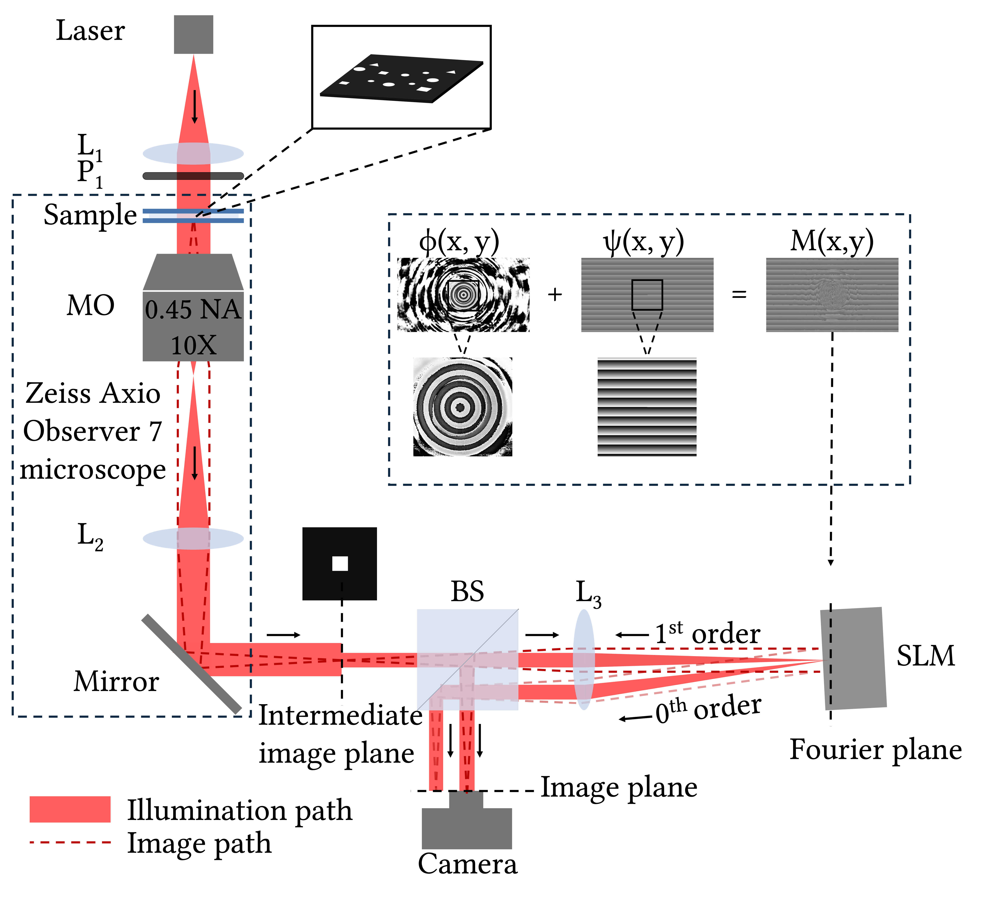

**Project Title:** Boosting the scientific and innovative capacity of bilateral consortium to advance the polarization-sensitive DHM with singular structured illumination for biomedical applications

**Budget:** 1,720,000TL

**Duration:** 15.01.2024 - 15.09.2026

Project financed under the 4th Joint Call for Proposals of TÜBİTAK – NARD (Moldova).

---

## Research Activity

    <!-- Image -->
    

        
    

    <!-- Project information -->
    

        <h4
            style="
                font-size: 15px;
                line-height: 1.4;
                margin: 0 0 12px 0;
           " >
            All-Optical Selective Target Highlighting for Augmented Reality Microscopy
        </h4>
        <!-- Links -->
        

            <!-- Project site -->
            <a
                href="/research/123n774/target-highlighting/"
                class="btn btn-primary"
                style="
                    font-size: 13px;
                    line-height: 1.2;
                    padding: 7px 12px;
                "
            >
                Project site →
            </a>
            <!-- Manuscript -->
            <a
                href="https://opg.optica.org/optcon/fulltext.cfm?uri=optcon-5-8-2708"
                class="btn btn-primary"
                target="_blank"
                rel="noopener"
                style="
                    font-size: 13px;
                    line-height: 1.2;
                    padding: 7px 12px;
                "
            >
                Manuscript ↗
            </a>
            <!-- Supplementary Material -->
            <a
                href="https://opticapublishing.figshare.com/articles/journal_contribution/Supplementary_document_for_All-Optical_Selective_Target_Highlighting_for_Augmented_Reality_Microscopy_-_7967150_pdf/32886380?file=67315379"
                class="btn btn-primary"
                target="_blank"
                rel="noopener"
                style="
                    font-size: 13px;
                    line-height: 1.2;
                    padding: 7px 12px;
                "
            >
                Supplementary Material ↗
            </a>
        

    

